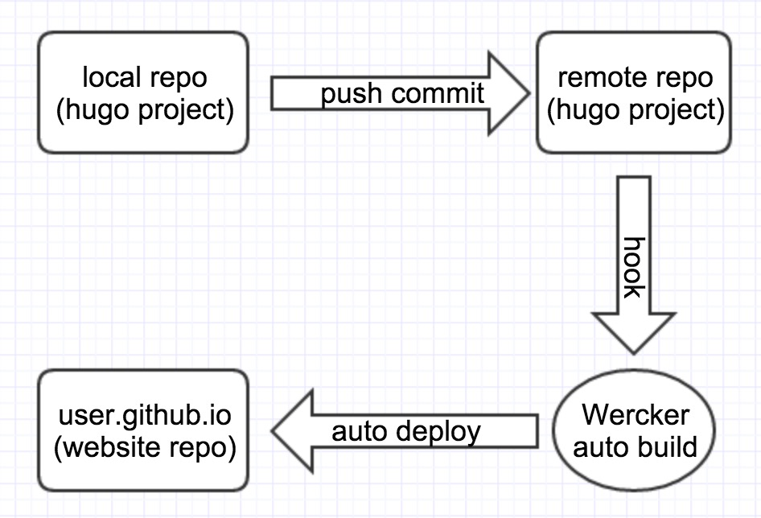

### What

​	用markdown写博客，用git进行版本控制，用[Hugo](https://gohugo.io/)生成网站，用[Wercker](http://wercker.com/)自动化部署到 GitHubPage

### Why

​	一直都想好好维护自己的个人博客，曾尝试用自建的WordPress写过几篇文章，后无疾而终。原因种种，种种原因，就不写在这里了。然而理想依然在，折腾无止境。

​	想了一下，我对这一次搭建的个人博客有下面一些要求：

- 使用git管理

- 使用markdown编辑

- 越简单越好

​	前两个要求是因为不想学习新软件的使用，而是花时间在一些能一直用的技术上。最后一个要求是因为懒，不想维护服务器，不想做各种配置，这些复杂的东西实在太容易忘记了。

### How

​	作为一个软件开发人员，最熟的就是代码仓库了，如果维护个人博客就像维护一个代码仓库一样就好了。写上一篇博客，commit，push，然后大功告成！想想就开心啊。

​	为了不维护服务器，选用了Github Pages，感谢非常有良心的github；使用[Hugo](https://gohugo.io/)（对golang感兴趣，所以选了这个）来作为website engine，负责将文件构建成网站；使用[Wercker](http://wercker.com/)来做自动化部署，每次push新的commit都会重新编译和部署网站。

​	具体实现主要参考了Hugo的文档

1. 本地新建Hugo Project，push到Github，这是代码仓库
2. 在Github上新建 [your username].github.io，这是博客仓库
3. 连接代码仓库到Wercker，配置自动部署，将代码仓库的public文件夹内容push到博客仓库即可

具体参见： [my-hugo-github-pages](https://github.com/lrhehe/my-hugo-github-pages)

可以参考：

[Hosting on GithubPages](https://gohugo.io/tutorials/github-pages-blog/)

[Automated deployments with Wercker](https://github.com/lrhehe/my-hugo-github-pages)

[lrhehe.github.io](https://github.com/lrhehe/lrhehe.github.io)

### Tips

1. 如果是通过 submodule 引入的 theme，那么需要添加 submodule update 的逻辑，可以参考： [wercker - docs - Using git Submodules](https://www.google.com/url?sa=t&rct=j&q=&esrc=s&source=web&cd=1&cad=rja&uact=8&ved=0ahUKEwiqlsq9nvDLAhVIt4MKHWsrBCsQFggcMAA&url=http%3A%2F%2Fdevcenter.wercker.com%2Fdocs%2Fgit%2Fsubmodules.html&usg=AFQjCNEdtOoVeQdpduB7DJ5Ym-jn297HPw&sig2=UdTKHn1ILVLZnueuh7YyQA&bvm=bv.118443451,d.amc)，具体配置可以参考我在用的 [wercker.yml]( https://github.com/lrhehe/my-hugo-github-pages/blob/master/wercker.yml)
2. 如果有自己的域名，可以参考: [Using a custom domain with GitHub Pages](https://help.github.com/articles/using-a-custom-domain-with-github-pages/)

### Conclude

- 清楚需求很重要，根据需求来选合适的实现方案
- 连接的红利，Wrecker 和 Github 相连，让世界变简单

